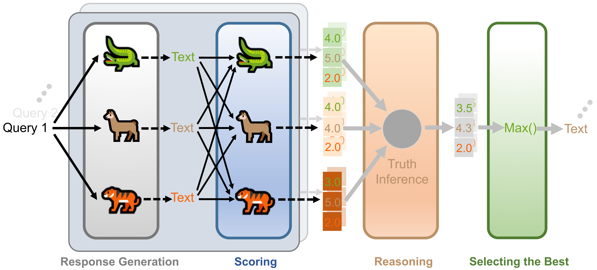

<h1 align="center">LLM-PeerReview</h1>

<p align="center">
  <a href='https://arxiv.org/abs/2512.23213'>
    </a>
  <a href="https://zeyuji.github.io/LLM-PeerReview/">
    </a>
  <a href="https://mp.weixin.qq.com/s/qqR5BW-TkHBaqPA5O-tWXw">
    </a>
  
</p>

## ✨ Repository Highlights

> 🔥 **Official Implementation of "Scoring, Reasoning, and Selecting the Best! Ensembling Large Language Models via a Peer-Review Process" (arXiv 2025)**

> 📌 **This repository provides:**
> - 🌀 **Two variants of LLM-PeerReview:** LLM-PeerReview-Average & LLM-PeerReview-Weighted
> - 📖 **Reproductions of recent LLM Ensemble baselines:** Random, GaC, Agent-Forest, Smoothie-Global and Smoothie-Local
>   <details>
>   <summary><small>Click to see references</small></summary>
>   
>   - **Random:** [Lu et al., 2024](https://arxiv.org/abs/2401.02994) and [Guha et al., 2024](https://arxiv.org/abs/2412.04692)  
>   - **GaC:** [Yu et al., 2024](https://arxiv.org/abs/2406.12585)  
>   - **Agent-Forest:** [Li et al., 2024](https://arxiv.org/abs/2402.05120)  
>   - **Smoothie:** [Guha et al., 2024](https://arxiv.org/abs/2412.04692)
>   </details>
> - 📊 **Evaluation on multiple benchmarks:** GSM8K, MATH, TriviaQA, and AlpacaEval

> 📢 **Welcome to use! If you find this project helpful, please consider giving it a ⭐ star!**

## 💡 Overview

<div align="center">
    
</div>

<details><summary><strong>Framework of LLM-PeerReview</strong></summary><br>

**LLM-PeerReview** is an unsupervised LLM Ensemble method that selects the most ideal response from multiple LLM-generated candidates for each query, harnessing the collective wisdom of multiple models with diverse strengths. It is built on a novel, peer-review-inspired framework that offers a clear and interpretable mechanism, while remaining fully unsupervised for flexible adaptability and generalization.

The proposed LLM-PeerReview contains three steps: 

(1) Scoring: For a given query, after each LLM independently generates a response (analogous to a submitted academic paper), LLM-PeerReview applies the LLM-as-a-Judge technique (and the proposed flipped-triple scoring trick), treating each model as a reviewer to assign scores to all candidate responses;

(2) Reasoning: LLM-PeerReview then uses a truth inference algorithm——analogous to a senior reviewer——to estimate a final score for each response. (Notably, for the variant LLM-PeerReview-Weighted, the inference algorithm is performed using score information across all queries, allowing the model to learn each LLM’s scoring behavior using global information from the dataset, thereby enabling fine-grained, reliability-aware score aggregation); 

(3) Selecting the best: Finally, for each query, LLM-PeerReview selects the response with the highest final score as the ensemble output—analogous to how a senior reviewer chooses the best paper from a specific submission pool.

</details>


## 1. Environment & Setup

### 1.1 System Requirements

Before using this project, please ensure your development environment meets the following requirements:

- **Operating System**: Linux (Ubuntu 20.04 or higher recommended)
- **Python Version**: Python 3.10.16 or higher
- **Hardware Requirements**:
  - **GPU**: NVIDIA V100 32GB or equivalent GPU for faster inference with large models (CUDA support required)
  - **Memory (RAM)**: Minimum 16GB RAM
  - **Storage**: At least 100GB of SSD storage for model and data processing
  - **Processor**: Intel i7 or higher, or equivalent AMD processor

### 1.2 Create a Virtual Environment

It is recommended to create a virtual environment to manage dependencies for this project. You can create a virtual environment using `venv` or `conda`.

- **Using `venv`**:
  
  ```bash
  python -m venv .venv
  source .venv/bin/activate
  ```

- **Using `conda`**:
  
  ```bash
  conda create -n llm-peerreview python=3.10.16
  conda activate llm-peerreview
  ```

### 1.3 Install Dependencies

Install all required dependencies by running:

```bash
pip install -r requirements.txt
```

If you haven't downloaded the required large models yet, you can use the following script to download them:

```bash
bash ./Script/LLM_Download.sh
```

This will automatically download the necessary models and set them up in the appropriate directories.


## 2.Usage
This project is organized into a structured pipeline for generating, scoring, ensembling, and evaluating LLM responses. 

### Workflow Summary

1. **Generate Responses**: Use scripts in `Script/Response_Generate/` to obtain candidate responses from individual models.
2. **Score Responses**: Employ the PeerReview scoring scripts in `Script/Response_Scoring/` to have LLMs evaluate each other's responses.
3. **Apply Ensemble Methods**: Run scripts in `Script/Ensemble_Generate/` to produce a single best response per query using various selection or aggregation strategies.
4. **Evaluate Results**: Use the scripts in `Script/Response_Evaluation/` to assess and compare the performance of individual models, scoring outcomes, and different ensemble methods.

### 2.0 Quick Start (Unified Pipeline)

To facilitate reproducibility, we provide pre-generated model responses in the `LLM_Response/` directory. This allows you to jump directly to the scoring and ensemble stages without spending hours on local inference.

We provide a unified pipeline script that integrates all stages—from peer-review scoring to ensemble selection and final evaluation—into a single command.

**Usage:**

```bash
bash ./Script/run_baseline.sh --method <METHOD_NAME> --dataset <DATASET>
```

**Examples:**

```bash
# Run LLM-PeerReview-Average on TriviaQA
bash ./Script/run_baseline.sh --method LLM-PeerReview-Average --dataset TriviaQA

# Run Random baseline on GSM8k (short options)
bash ./Script/run_baseline.sh -m Random -d GSM8k

# Show all available options (-h or --help)
bash ./Script/run_baseline.sh --help
```

<details>
<summary><strong>Supported Methods & Datasets</strong></summary>

| Category | Options |
| --- | --- |
| **Baselines** | `Random`, `Smoothie-Global`, `Smoothie-Local`, `Agent-Forest`, `GaC` |
| **Proposed (Ours)** | `LLM-PeerReview-Average`, `LLM-PeerReview-Weighted` |
| **Datasets** | `GSM8k`, `MATH`, `TriviaQA`, `AlpacaEval` |

</details>


### 2.1 Response Generation

Generate responses from various LLMs on benchmark datasets:

- **Standard 7B Models**: Generate responses using four different 7B models (Llama-3.1-8B, Mistral-7B, Qwen2-7B, Qwen2.5-7B) on the target datasets.

  ```bash
  bash ./Script/Response_Generate/New_7B_Response_Generate.sh
  ```

**Output**: Generated responses are saved in the `LLM_Response/` directory with organized subfolders for each model and dataset.

### 2.2 Response Scoring (PeerReview Method)

Score the generated responses using our PeerReview methodology. We provide scoring scripts for different datasets:

- **GSM8K Dataset**:

  ```bash
  bash ./Script/Response_Scoring/judge/judge_gsm8k400.sh
  ```

**Note**: The scoring process leverages the LLM-as-a-Judge paradigm, where each available LLM acts as a reviewer to evaluate and assign scores to all candidate responses, forming the foundation for subsequent ensemble selection.

### 2.3 Ensemble Methods

Combine multiple model responses using different ensemble strategies. We compare our proposed method against several established baselines:

- <details><summary><strong>1) Random</strong>: A random-selection baseline that returns a response from a randomly chosen LLM in the ensemble.</summary>

  ```bash
  bash ./Script/Ensemble_Generate/Random_Generate.sh
  ```
  </details>

- <details><summary><strong>2) GaC</strong>: A recent token-level ensemble-during-inference method.</summary>

  ```bash
  bash ./Script/Response_Generate/GaC_7B_Response_Generate.sh
  ```
  </details>

- <details><summary><strong>3) Agent Forest</strong>: A recently proposed similarity-based ensemble method.</summary>

  ```bash
  bash ./Script/Ensemble_Generate/Agent_forest_Generate.sh
  ```
  </details>

- <details><summary><strong>4) Smoothie-Global & Smoothie-Local</strong>: Strong similarity-based ensemble methods that operate at the global level and the local level, respectively.</summary>

  ```bash
  # Global variant
  bash ./Script/Ensemble_Generate/Smoothie-Global_Generate.sh
  
  # Local variant
  bash ./Script/Ensemble_Generate/Smoothie-Local_Generate.sh
  ```
  </details>

- **5) PeerReview Average (Ours)**: Our primary ensemble method which averages scores from multiple LLM judges.

  ```bash
  bash ./Script/Ensemble_Generate/PeerReview_Average_Generate.sh
  ```

- **6) PeerReview Average with Truth Inference (Ours)**: An enhanced variant that employs a graphical-model-based truth inference algorithm for reliability-aware score aggregation.

  ```bash
  bash ./Script/Ensemble_Generate/PeerReview_Average_Ti_Generate.sh
  ```

### 2.4 Evaluation

Evaluate the quality of the generated responses and the performance of different ensemble methods:

- <details><summary><strong>1) Single Model Evaluation</strong>: Evaluate responses from the standard 7B models.</summary>

  ```bash
  bash ./Script/Response_Evaluation/New_7B_Response_Evaluate.sh
  ```
  </details>

- <details><summary><strong>2) GaC Baseline Evaluation</strong>: Evaluate responses from the GaC baseline model.</summary>

  ```bash
  bash ./Script/Response_Evaluation/GaC_7B_Response_Evaluate.sh
  ```
  </details>

- <details><summary><strong>3) Scored Response Evaluation</strong>: Evaluate the outcomes after applying the PeerReview scoring process.</summary>

  ```bash
  bash ./Script/Response_Evaluation/New_7B_Judge_Response_Evaluate.sh
  ```
  </details>

- <details><summary><strong>4) Baseline Ensemble Evaluation</strong>: Evaluate the results produced by baseline ensemble methods (Random, Agent Forest, Smoothie).</summary>

  ```bash
  bash ./Script/Response_Evaluation/Baseline_Ensemble_Response_Evaluate.sh
  ```
  </details>

- **5) PeerReview Ensemble Evaluation**: Evaluate the final outputs of our proposed PeerReview ensemble methods.

  ```bash
  bash ./Script/Response_Evaluation/PeerReview_Average_Ensemble_Response_Evaluate.sh
  ```


## 📚 Citation
```bibtex
@misc{chen2026scoringreasoningselectingbest,
      title={Scoring, Reasoning, and Selecting the Best! Ensembling Large Language Models via a Peer-Review Process}, 
      author={Zhijun Chen and Zeyu Ji and Qianren Mao and Hao Wu and Jinhuan Song and Junhang Cheng and Bangjie Qin and Zhuoran Li and Jingzheng Li and Kai Sun and Zizhe Wang and Yikun Ban and Zhu Sun and Xiangyang Ji and Hailong Sun},
      year={2026},
      eprint={2512.23213},
      archivePrefix={arXiv},
      primaryClass={cs.CL},
      url={https://arxiv.org/abs/2512.23213}, 
}
